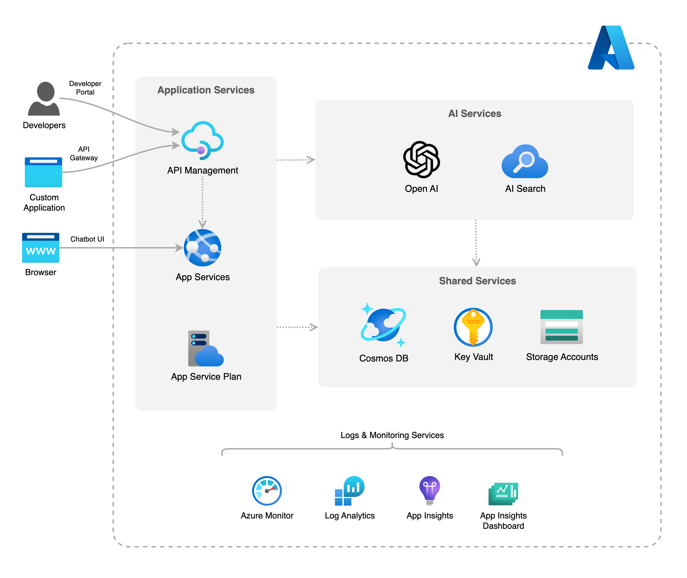

# AI Assistant Backend Services Accelerator

[](https://github.com/ffilardi-insight/azure-ai-assistant-accelerator)
[](https://vscode.dev/redirect?url=vscode://ms-vscode-remote.remote-containers/cloneInVolume?url=https://github.com/ffilardi-insight/azure-ai-assistant-accelerator)


## About

This solution demonstrates a simple implementation of a ChatGPT-based AI assistant web frontend with a re-usable and scalable backend API services written in Python/FastAPI.

It's built using Azure OpenAI models and Azure AI Cognitive Search to index and store plain-text with vectorised data, enabling a RAG (Retrieval Augmented Generation) approch using a hybrid search with semantic re-ranker.

The objective is to demonstrate the capabilities of Azure AI and application services to provide a secure and powerful backend service, by encapsulating the logic required for any external systems to interact with a chatbot assistant via REST interface.

The following assets are included:

- Infrastructure-as-code (IaC) bicep template files under the `infra` folder to provision and setup resources.
- The core application code under the `app/` folder, including the backend logic and a simple user interface to interact with the assistant.
- The YAML configuration file `azure.yaml` in the root folder, to specify the AZD project and application metadata.
- Continuous deployment workflows for CI providers such as GitHub Actions under the `.github` directory.
- A [dev container](https://containers.dev) configuration file under the `.devcontainer` directory that installs infrastructure tooling by default. This can be readily used to create cloud-hosted developer environments such as [GitHub Codespaces](https://aka.ms/codespaces), or locally/on-premises environments using Docker.

## Backend Architecture


### API Endpoints

The Assistant API is configured in API Management instance using its own product definition and pair of subscription keys, used to access its endpoints.

##### <u>Chat Completion</u>

Chat completion endpoint receives an input request containing the user prompt, session id, user id and user name, performs the core workflow logic that consists of retrieving the chat history for that user/session, search and retrieve for information from the index store, and communicate with the GPT model, sending back the model response for the user's request.

The endpoint can be acessed at:<br>https://YOUR-APIM-RESOURCE-NAME.azure-api.net/assistant/v1/api/chat

Sample request body:<br>

```json
{
    "session_id": "string",
    "user_id":"string",
    "user_name":"string",
    "user_prompt":"string"
}
```

##### <u>User Feedback</u>

User feedback endpoint receives a positive/negative feedback for a given model response (e.g., when the user click on a thumbs up/down), receiving an identification of the session, the response, and a true (positive) or false (negative) feedback, to be updated in the chat history database againt the respective response record.

The endpoint can be acessed at:<br>https://YOUR-APIM-RESOURCE-NAME.azure-api.net/assistant/v1/api/feedback

Sample request body:<br>

```json
{
    "id": "string",
    "session_id": "string",
    "feedback_rating": true
}
```

#### Important Notes

- More information about Assistant API endpoints, including example, requests and responses can be found in the API Management portal or via Open API Specification defintion file, located at `/infra/modules/apim/api/appservice-api.json`

- The standard Azure OpenAI API is also exposed via API Management service for better control and managmenet, in case your solution needs to use the GPT and Embedding models for custom/speciifc tasks outside the assistant context - or as a complement to its functionalities. More information can also be found in the API Management portal or via Open API Specification defintion file, located at `/infra/modules/apim/api/openai-api.json`

- The solutoin is fully compatible with OpenAI models (https://openai.com/). More details on how to configure it in the <b><i>Scripts</i></b> section below.

- The data ingestion process, represented in the diagram by the greay control flow arrows, are described for refrence only and are not implemented as part of this accelerator. It must be manually configured based on your data source type and data format to be ingested.

- The content monitoring & safety feature enabled in the OpenAI models are based on Microsoft standard "DefaultV2" filter for both user prompts (input) and model completions (output). For a more personalised safety, a custom content filter must be set and assigned to the models.


## Assistant UI

The provided Assistant UI is built using simple HTML/CSS + Javascript. It's deployed together with the backend services as a simple example of how to interact with both Assistant API endpoints. Authentications via Microsoft or external providers can be set via Azure App Services settings.


## Solution Components

| Service | Description |
|---------|-------------|
| App Services | Hosts the web application front-end (UI) and backend (API) services. |
| Azure OpenAI | Provide the GPT models for LLM and embeddings.
| Azure AI Cogniive Search | The index and vector database to enable RAG functionality.
| Azure Cosmos DB | The chat history database.
| API Management | API management layer to secure and manage the backend APIs. It also provices Open API specifications for all endpoints.
| KeyVault | Secure the sensitive information, such as API key, as secrets. It's utilised by the App Services to connect to other services.
| Storage Blob | Utilised to provide source data files (CSV) to be indexed by the Cognitive Search service.

### High-Level Components Diagram


## Infra Deployment Templates

Resources are deployed into multiple resources groups by default, as per default classification list below.

### Logs & Monitoring (Resource Group Id: `monitor`)

| Resource | Type | File Location |
|----------|--------|----------|
| App Insights | Monitoring | `/infra/modules/monitor/resources/applicatinoinsights.bicep` |
| App Insights Dashboard | Monitoring | `/infra/modules/monitor/resources/applicatinoinsights-dashboard.bicep` |
| Log Analytics Workspace | Logs | `/infra/modules/monitor/resources/loganalytics.bicep` |

### Shared Services (Resource Group Id: `shared`)

| Resource | Type | File Location |
|----------|--------|----------|
| Key Vault | Security | `/infra/modules/keyvault/resources/vault.bicep` |
| Key Vault Role Assignment | Security | `/infra/modules/keyvault/config/role-assignment.bicep` |
| Key Vault Secret | Security | `/infra/modules/keyvault/config/secret.bicep` |
| Storage Account | Storage | `/infra/modules/storage/resources/account.bicep` |
| Storage Blob | Storage | `/infra/modules/storage/resources/blob.bicep` |

### AI Services (Resource Group Id: `ai`)

| Resource | Type | File Location |
|----------|--------|----------|
| OpenAI Account | AI Services | `/infra/modules/ai/resources/openai.bicep` |
| AI Search |  AI Services | `/infra/modules/ai/resources/cognitivesearch.bicep` |

### Application Services (Resource Group Id: `app`)

| Resource | Type | File Location |
|----------|--------|----------|
| API Management | API | `/infra/modules/apim/resources/apim-service.bicep` |
| App Service Plan | Hosting | `/infra/modules/app/resources/service-plan.bicep` |
| App Service | Application | `/infra/modules/app/resources/webapp.bicep` |
| Cosmos DB | Database | `/infra/modules/cosmosdb/resources/account.bicep` |

## Application Deployment

The application source code is split into backend and frontend folders, so they can be better managed and updated independently.

| Application Module | Source Code Location | Description |
|----------|----------|----------|
| Backend | `/app/backend/` | Core logic for backend API endpoints (chat and feedback), services configuration and system prompt definitions |
| Frontend | `/app/frontend/` | A simple HTML/JS single page chat interface to interact with the AI model |

## Naming convention

The pattern specified below is used to define resource names, including resource group, when the values are not provided in the parameters file.

    {resource_abbreviation}-{environment_name}-{token}

The ***resource abbreviation*** is pre-defined in the configuration file `abbreviations.json` in the root folder.  The ***token*** value is an unique string created from a combination of the subscription id, environment name and location selected.

## Prerequisites

#### Running locally:

- Azure CLI or Azure PowerShell
- Azure Developer CLI (AZD)
- Azure Bicep
- Visual Studio Code

#### Runnning locally on a Dev Container:

- VSCode Dev Containers extension
- Docker

#### Running on cloud:

- GittHub account (if running on GitHub Codespace)

<br>

> **NOTE:** When running on GitHub Codespace, it's possible to connect to it using VSCode web client inside your browser, or connect using your local VSCode desktop client to a remote Codespace container instance.

## Deploying to Azure using AZD

### Step 1: Initialize a new `azd` environment (only once)

```shell
azd init
```

It will prompt you to provide a name that will later be used in the name of the deployed resources.

### Step 2: Autheneticate to Azure (only once)

```shell
azd auth login
```

A new web browser window will open for an interactive login into your Azure tenant. After logged, you can close the window.

### Step 3: Provision and deploy all the resources

```shell
azd up
```

> **NOTE:** While `azd up` deploys both infrastructure and application code, you may want to deploy one of another independently. To do that, you can use `azd provision` for infra deployment only, and `azd deploy` for application code deployment only.

### Step 4: Running locally (optional)

To run the application locally, run the following script to set the necessary keys as local environment variables:

```shell
bash .scripts/load-env-secrets.sh <keyvault-name> <keyvault-resourcegroup>
```

## CI/CD pipeline

This project includes a pre-configured Github Action workflow for deploying the resources to Azure. That workflow requires a few Azure-related authentication secrets to be stored as Github action secrets. To set that up, just run the following command:

```shell
azd pipeline config
```

## Removing all resources

To remove all resources and resource group, including purging soft-deleted services such as Cognitive Services, Key Vault and API Management, just run the following command:  

```shell
azd down --purge
```

> **IMPORTANT:** Due to some cross-resource dependencies, deleting the resources may fail due to the order they are deleted (controlled by AZD internally). If it fails, you may need to remove and purge resources manually.

### API Management soft-delete

If you deleted the deployment via the Azure Portal, and you want to run this deployment again, you might run into the issue that the APIM name is still reserved because of the soft-delete feature. You can remove the soft-delete by using this script:

```shell
bash .scripts/purge-apim.sh <apim-instance-name> <apim-location>
```
